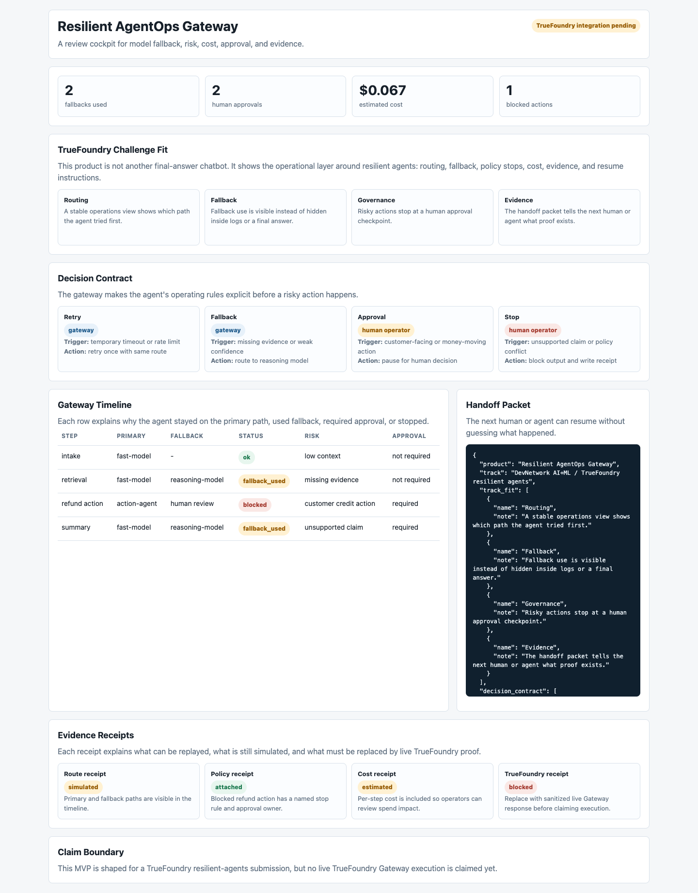
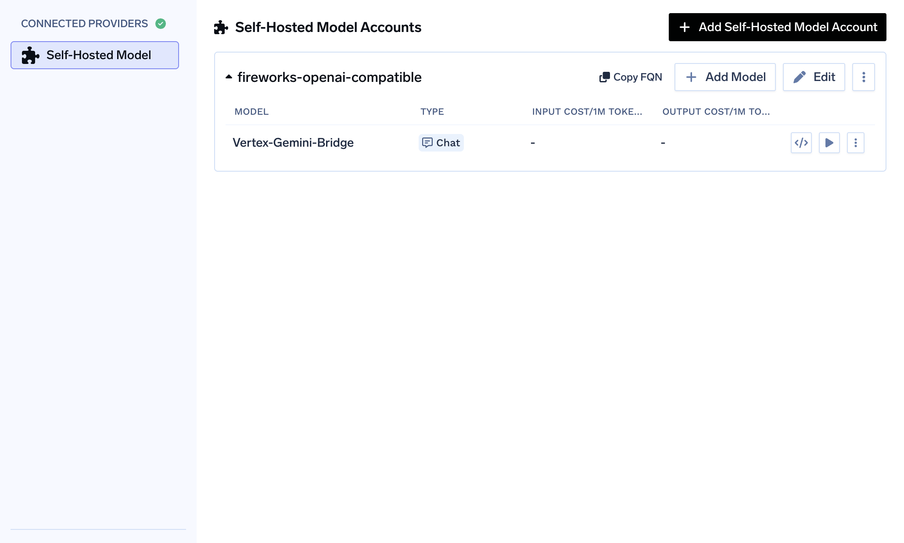

# Resilient AgentOps Gateway

Hackathon target: DevNetwork AI+ML Hackathon 2026

Track direction: TrueFoundry resilient agents

## Product Thesis

Agents do not just need better prompts. They need a visible gateway that shows failures, fallbacks, cost, risk, and human approval.

Resilient AgentOps Gateway is a dashboard for understanding how an AI workflow behaved when the first model/tool path was not good enough.

It is designed to make the TrueFoundry-style operations story visible: routing, fallback, governance, evidence, cost, and resume instructions.

The latest surface also includes an explicit decision contract and evidence receipts, so a reviewer can see when the gateway retries, when it falls back, when it pauses for human approval, and which proof is attached versus still simulated.

## Judge Quick Read

Who it helps: teams running AI agents that need reliable operations, not just impressive final answers.

The problem: when an agent fails, retries, changes model, spends money, or needs human approval, that story often disappears inside logs.

How Resilient AgentOps Gateway solves it: the cockpit shows route decisions, fallback, risk, cost, approval gates, evidence receipts, and the handoff packet in one reviewable surface.

What is proven now: the public app, screenshots, demo video draft, verifiers, decision contract, Gateway I/O contract, evidence receipts, one live TrueFoundry Gateway response, and a sanitized TrueFoundry dashboard proof are present.

## Live Demo

GitHub Pages target:

```text
https://daideguchi.github.io/resilient-agentops-gateway/
```

## Demo Media

Current live screenshot:



Current local verification screenshot:


TrueFoundry Gateway proof:



Sanitized live response proof:

```text
media/truefoundry-gateway-response.json
```

Demo video status: draft. The video describes the product workflow; the live TrueFoundry proof is represented by the screenshot and sanitized response JSON above.

Current local demo video:

```text
media/resilient-agentops-gateway-demo.mp4
```

Raw demo video URL:

```text
https://raw.githubusercontent.com/daideguchi/resilient-agentops-gateway/main/media/resilient-agentops-gateway-demo.mp4
```

This is a generated narration draft for review. The repository proof files now contain the live TrueFoundry Gateway evidence.

## Verify

```bash
node scripts/verify_gateway.mjs
python3 scripts/verify_no_secrets.py
python3 scripts/verify_readme_review_hub.py
python3 scripts/verify_claim_boundary.py
python3 scripts/verify_demo_video.py
python3 scripts/verify_truefoundry_live.py
```

Expected:

```text
gateway_verify_ok
track_fit_items=4
policy_items=4
receipt_items=4
contract_items=4
gateway_no_secrets_ok
gateway_readme_review_hub_ok
gateway_claim_boundary_ok
gateway_demo_video_ok
truefoundry_live_proof_ok
```

## TrueFoundry Status

Live proof has been completed with a TrueFoundry-hosted self-hosted model account and a small OpenAI-compatible Gateway request. The public repository stores only sanitized proof:

- `media/truefoundry-gateway-proof.png`
- `media/truefoundry-gateway-response.json`

The runtime API key remains outside the repository.

Live-proof commands:

```bash
python3 scripts/truefoundry_smoke_request.py
python3 scripts/verify_truefoundry_live.py
```

`scripts/truefoundry_smoke_request.py` requires local environment variables for the TrueFoundry API key and model. It writes sanitized metadata only.

## Submission Docs

- [Submission package](SUBMISSION_PACKAGE.md)
- [Architecture](ARCHITECTURE.md)
- [TrueFoundry integration plan](docs/TRUEFOUNDRY_INTEGRATION_PLAN.md)
- [Gateway I/O contract](docs/GATEWAY_IO_CONTRACT.md)
- [Devpost draft](submission/devpost-draft.md)
- [Demo script](submission/demo-script.md)
- [Build journey](submission/build-journey.md)

## Claim Boundary

The demo timeline is a product scenario. The live claim is narrower and verified: one TrueFoundry Gateway chat-completion request returned a sanitized 200 response, and a TrueFoundry dashboard proof image is attached.
